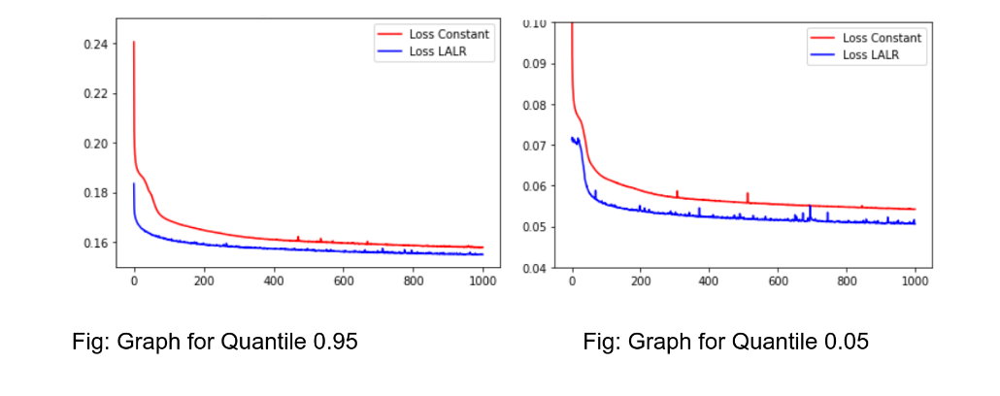

# Quantile-Regression_Lipschitz
Implemented the Paper - LALR: Theoretical and Experimental validation of Lipschitz Adaptive Learning Rate in Regression and Neural Networks 
The purpose was using Quantile Regression with check loss under the influence of Lipschitz Adaptive Learning Rate  
# Dataset  
There were 3 dataset used  
1) California Housing Dataset  
2) Boston Housing Dataset  
3) Energy Efficiency Dataset  
# Result  
The result showed the performance was better while using LALR as the learning Rate in all 3 dataset as compared to constant LR  
California Housing 
  
Boston Housing  
  
Energy Efficiency  
  
